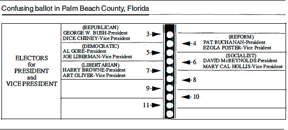

## Instructions

This assignment involves linear regression with one predictor. The data can be found on Sakai: go to Resources $\rightarrow$ Homework Datasets $\rightarrow$ Methods and Data Analysis 1. Please type your solutions using R Markdown, LaTeX or any other word processor but be sure to knit or convert the final output file to ".pdf". Submissions should be made on gradescope: go to Assignments $\rightarrow$ Methods and Data Analysis 1.

## Questions

The questions below were taken and adapted from Chapter 7 of [Ramsey, F.L. and Schafer, D.W. (2013), "The Statistical Sleuth: A Course in Methods of Data Analysis (3rd ed)."](https://www.amazon.com/Statistical-Sleuth-Course-Methods-Analysis/dp/1133490670)

1. <font color="blue">OLD FAITHFUL.</font>
Old Faithful Geyser in Yellowstone National Park, Wyoming, derives its name and its considerable fame from the regularity (and beauty) of its eruptions. As they do with most [geysers](https://en.wikipedia.org/wiki/Geyser) in the park, rangers post the predicted times of eruptions on signs nearby, and people gather beforehand to witness the show. R.A. Hutchinson, a park geologist, collected measurements of the eruption durations (in minutes) and the subsequent intervals before the next eruption (also in minutes) over an 8-day period.  
    *The data for this question can be found in the file "OldFaithful.csv" on Sakai.*  
      + Write down a regression model for predicting the interval between eruptions from the duration of the previous one. Make sure to use the right mathematical notation.
      + Fit the model to the data and interpret your results. In your answer, make sure you include the output from the regression model including the estimated intercept, slope, residual standard error, and R2.
      + Also, include the 95% confidence interval for the slope, and explain what the interval reveals about the relationship between duration and waiting time. 
      + Describe in a few sentences whether or not you think the regression assumptions are plausible based on residual plots (you don’t need to include the plots). 
      + Construct 95% prediction intervals for the waiting time until the next eruption if the duration of the previous one was 2 minutes, 2.5 minutes, 3 minutes, 3.5 minutes and 4 minutes. Present your answer as a single plot.

2. <font color="blue">RESPIRATORY RATES FOR CHILDREN</font>.
A high respiratory rate is a potential diagnostic indicator of respiratory infection in children. To judge whether a respiratory rate is truly "high," however, a physician must have a clear picture of the distribution of "normal" respiratory rates. To this end, Italian researchers measured the respiratory rates of 618 children between the ages of 15 days and 3 years.  
    *The data for this question can be found in the file "Respiratory.csv" on Sakai.*  
      + Analyze the data and include a useful plot that a physician could use to assess a normal range of respiratory rate for children of any age between 0 and 3.
      + Include the output of the regression that predicts (possibly transformed) respiratory rates from (possibly transformed) age. Also, is there enough evidence that the model assumptions are reasonable for this data?
      + Demonstrate the usefulness of the model by providing 95% prediction intervals for the rate for three individual children: a 1 month old, an 18 months old, and a 29 months old.
      
3. <font color="blue">THE DRAMATIC U.S. PRESIDENTIAL ELECTION OF 2000.</font>
The U.S. presidential election of November 7, 2000 was one of the closest in history. As returns were counted on election night it became clear that the outcome in the state of Florida would determine the next president. At one point in the evening, television networks projected that the state was carried by the Democratic nominee, Al Gore, but a retraction of the projection followed a few hours later. Then, early in the morning of November 8, the networks projected that the Republican nominee, George W. Bush, had carried Florida and won the presidency. Gore called Bush to concede. While on route to his concession speech, though, the Florida count changed rapidly in his favor. The networks once again reversed their projection, and Gore called Bush to retract his concession. When the roughly 6 million Florida votes had been counted, Bush was shown to be leading by only 1,738, and the narrow margin triggered an automatic recount. The recount, completed in the evening of November 9, showed Bush's lead to be less than 400.  
    Meanwhile, angry Democratic voters in Palm Beach County complained that a confusing "butterfly" lay-out ballot caused them to accidentally vote for the Reform Party candidate Pat Buchanan instead of Gore. The ballot, as illustrated below, listed presidential candidates on both a left-hand and a right-hand page.
<div style= "float:left;position: relative; margin-left: 0px">
```{r setup, echo=FALSE, fig.align="left"}

```
</div>
Voters were to register their vote by punching the circle corresponding to their choice, from the column of circles between the pages. It was suspected that since Bush's name was listed first on the left-hand page, Bush voters likely selected the first circle. Since Gore's name was listed second on the left-hand side, many voters---who already knew who they wished to vote for---did not bother examining the right-hand side and consequently selected the second circle in the column; the one actually corresponding to Buchanan. Two pieces of evidence supported this claim: Buchanan had an unusually high percentage of the vote in that county, and an unusually large number of ballots (19,000) were discarded because voters had marked two circles (possibly by inadvertently voting for Buchanan and then trying to correct the mistake by then voting for Gore).  
    *The data for this question can be found in the file "Elections.csv" on Sakai.*
      + Make a scatterplot of the variables *Buchanan2000* and *Bush2000*. What evidence is there in the scatterplot that Buchanan received more votes than expected in Palm Beach County? 
      + Analyze the data without Palm Beach County results to obtain an equation for predicting Buchanan votes from Bush votes. (You should consider transformations!)
      + Include the output from the final regression model that you used, as well as evidence that the model fits the assumptions reasonably well.
      + Obtain a 95% prediction interval for the number of Buchanan votes in Palm Beach from this result, assuming the relationship is the same in this county as in the others. If it is assumed that Buchanan's actual count contains a number of votes intended for Gore, what can be said about the likely size of this number from the prediction interval?

## Grading

30 points: 10 points for each question
  
  